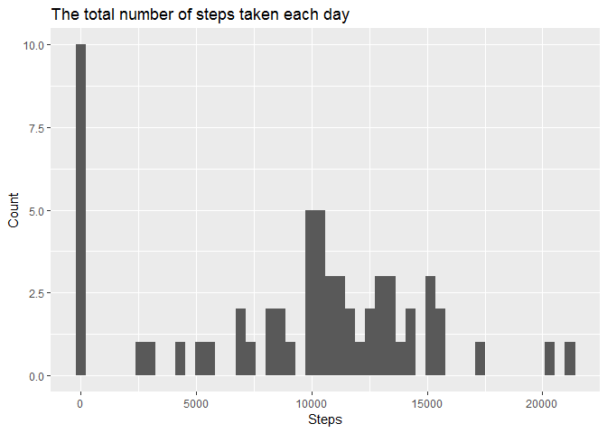
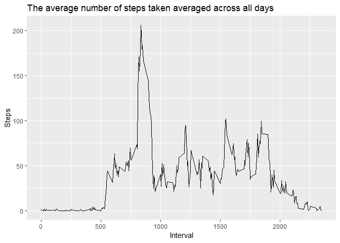
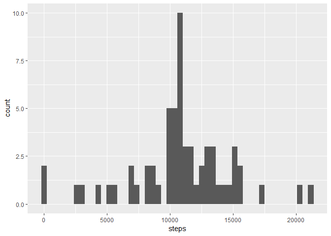
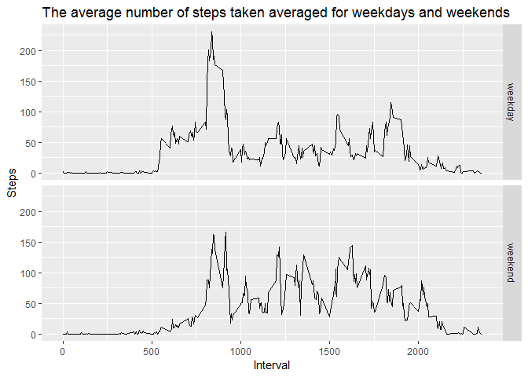

## Loading and preprocessing the data

Let's load data, convert date field to POSIX and take a look at the dataset

```r
library(dplyr)
```

```
## 
## Attaching package: 'dplyr'
```

```
## The following objects are masked from 'package:stats':
## 
##     filter, lag
```

```
## The following objects are masked from 'package:base':
## 
##     intersect, setdiff, setequal, union
```

```r
library(ggplot2)
DF <- read.csv(unz("activity.zip", "activity.csv"))
DF$date <- as.POSIXct(strptime(DF$date, format = "%Y-%m-%d"))
summary(DF)
```

```
##      steps             date               interval     
##  Min.   :  0.00   Min.   :2012-10-01   Min.   :   0.0  
##  1st Qu.:  0.00   1st Qu.:2012-10-16   1st Qu.: 588.8  
##  Median :  0.00   Median :2012-10-31   Median :1177.5  
##  Mean   : 37.38   Mean   :2012-10-31   Mean   :1177.5  
##  3rd Qu.: 12.00   3rd Qu.:2012-11-15   3rd Qu.:1766.2  
##  Max.   :806.00   Max.   :2012-11-30   Max.   :2355.0  
##  NA's   :2304
```


## What is mean total number of steps taken per day?


```r
ttl.steps.per.day <- DF %>% group_by(date) %>% summarize(steps = sum (steps, na.rm = TRUE))
ggplot(data=ttl.steps.per.day, aes(steps)) + geom_histogram(bins = 50) + 
  labs(title = "The total number of steps taken each day", x = "Steps", y = "Count")
```

<!-- -->

```r
mean.stps <- round(mean(ttl.steps.per.day$steps), digits = 2)
mdn.stps <- median(ttl.steps.per.day$steps)
paste("The mean of the total number of steps taken per day is", mean.stps, "steps. The median of the total number of steps taken per day is ", mdn.stps, "steps")
```

```
## [1] "The mean of the total number of steps taken per day is 9354.23 steps. The median of the total number of steps taken per day is  10395 steps"
```
The mean of the total number of steps taken per day is 9354.23 steps. The median of the total number of steps taken per day is 10395 steps.

The histogramm of the total number of steps has the form of a normal distribution but there are a quantity of records with 0 steps that exeeds all values. by that the steps distribution is left skewed.

## What is the average daily activity pattern?

```r
avg.steps.per.int <- DF %>% group_by(interval) %>% summarize(steps = mean (steps, na.rm = TRUE))
ggplot(avg.steps.per.int, aes(interval, steps)) + geom_line() +
  labs(title = "The average number of steps taken averaged across all days", x = "Interval", y = "Steps")
```

<!-- -->

```r
int.with.max.stps <- avg.steps.per.int[avg.steps.per.int$steps == max(avg.steps.per.int$steps),]$interval
paste("The 5-minute interval, on average across all the days in the dataset that contains the maximum number of steps is", int.with.max.stps)
```

```
## [1] "The 5-minute interval, on average across all the days in the dataset that contains the maximum number of steps is 835"
```
The 5-minute interval, on average across all the days in the dataset that contains the maximum number of steps is  835

Acording to the graph of the average intervl activity we have a peak for the moning time, a medium activity during the day and minimum activity for the night.

## Imputing missing values


```r
ttl_na<-sum(is.na(DF$steps))
DF.cmplt <- DF %>% group_by(interval) %>% mutate(steps = ifelse(is.na(steps), as.integer(round(mean(steps, na.rm=TRUE), digits = 0)), steps))

ttl.steps.per.day.cmplt <- DF.cmplt %>% group_by(date) %>% summarize(steps = sum (steps, na.rm = TRUE))
ggplot(data=ttl.steps.per.day.cmplt, aes(steps)) + geom_histogram(bins = 50)
```

<!-- -->

```r
mean.stps.cmplt <- round(mean(ttl.steps.per.day.cmplt$steps), digits = 2)
mdn.stps.cmplt <- median(ttl.steps.per.day.cmplt$steps)
paste("The mean of the total number of steps taken per day is", mean.stps.cmplt, "steps. The median of the total number of steps taken per day is ", mdn.stps.cmplt, "steps") 
```

```
## [1] "The mean of the total number of steps taken per day is 10765.64 steps. The median of the total number of steps taken per day is  10762 steps"
```

The total number of missing values in the dataset is 2304. To fill NA values we used avarage for the interval rounded to integer.

The mean of the total number of steps taken per day for the dataset with filled na is 1.076564\times 10^{4} steps and the median of the total number of steps taken per day is 10762 steps"

As we can see from the histogramm the steps distribution the amount of the 0 steps is big enough yet, but the mean practically equals to median and that is one of the charactristic of the un-skewed normal distribution.

## Are there differences in activity patterns between weekdays and weekends?


```r
DF.cmplt$weekday <- as.POSIXlt(DF.cmplt$date)$wday
DF.cmplt$weekday <- factor(ifelse(DF.cmplt$weekday == 0 | DF.cmplt$weekday == 6, "weekend", "weekday"))
avg.steps.per.int.wk <- DF.cmplt %>% group_by(weekday, interval) %>% summarize(steps = mean (steps, na.rm = TRUE))
ggplot(avg.steps.per.int.wk, aes(x = interval, y = steps)) + geom_line() + facet_grid(weekday ~ .) +
  labs(title = "The average number of steps taken averaged for weekdays and weekends", x = "Interval", y = "Steps")
```

<!-- -->

As we can see from the plot in the weekdays we have more high activity for the moning intervals, but for the weekends we have higer activity for the dayly intervals.
